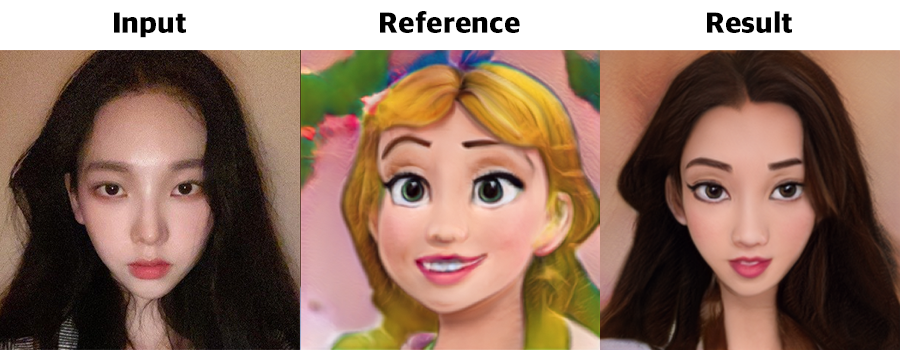
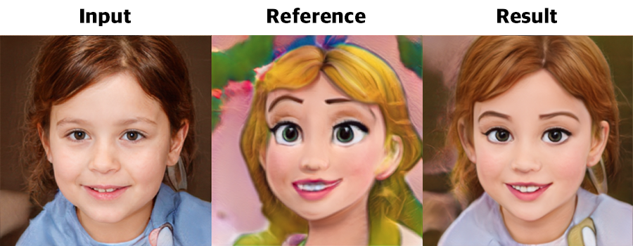

# Source code:
https://github.com/kairess/SOAT
Original : https://github.com/mchong6/SOAT

Dependency:
- Python 3
- PyTorch
- OpenCV


# Controllable Toonification using Pretrained StyleGAN2





## Code

[toonify.ipynb](toonify.ipynb)

## Pretrained Model

- [face.pt](https://drive.google.com/uc?id=1dOBo4xWUwM7-BwHWZgp-kV1upaD6tHAh)
- [disney.pt](https://drive.google.com/uc?id=1n2uQ5s2XdUBGIcZA9Uabz1mkjVvKWFeG)
## Reference

- https://github.com/mchong6/SOAT
- https://github.com/rosinality/stylegan2-pytorch

---

# StyleGAN of All Trades: Image Manipulation with Only Pretrained StyleGAN


This is the PyTorch implementation of [StyleGAN of All Trades: Image Manipulation with Only Pretrained StyleGAN](https://arxiv.org/abs/2111.01619). [](https://colab.research.google.com/github/mchong6/SOAT/blob/main/infinity.ipynb)

**Web Demo**
Integrated to [Huggingface Spaces](https://huggingface.co/spaces) with [Gradio](https://github.com/gradio-app/gradio). See demo for Panorama Generation for Landscapes: [](https://huggingface.co/spaces/akhaliq/SOAT)

>**Abstract:**<br>
Recently, StyleGAN has enabled various image manipulation and editing tasks thanks to the high-quality generation and the disentangled latent space. However, additional architectures or task-specific training paradigms are usually required for different tasks. In this work, we take a deeper look at the spatial properties of StyleGAN. We show that with a pretrained StyleGAN along with some operations, without any additional architecture, we can perform comparably to the state-of-the-art methods on various tasks, including image blending, panorama generation, generation from a single image, controllable and local multimodal image to image translation, and attributes transfer.


## How to use
Everything to get started is in the [colab notebook](https://colab.research.google.com/github/mchong6/SOAT/blob/main/infinity.ipynb).

## Toonification
For toonification, you can train a new model yourself by running
```bash
python train.py
```
For disney toonification, we use the disney dataset [here](https://github.com/justinpinkney/toonify). Feel free to experiment with different datasets.

## GAN inversion
To perform GAN inversion with gaussian regularization in W+ space,
```bash
python projector.py xxx.jpg
```
the code will be saved in ./inversion_codes/xxx.pt which you can load by
```python
source = load_source(['xxx'], generator, device)
source_im, _ = generator(source)

```

## Citation
If you use this code or ideas from our paper, please cite our paper:
```
@article{chong2021stylegan,
  title={StyleGAN of All Trades: Image Manipulation with Only Pretrained StyleGAN},
  author={Chong, Min Jin and Lee, Hsin-Ying and Forsyth, David},
  journal={arXiv preprint arXiv:2111.01619},
  year={2021}
}
```

## Acknowledgments
This code borrows from [StyleGAN2 by rosalinity](https://github.com/rosinality/stylegan2-pytorch)


---
# 자주 쓰는 명령어
	cd D:\Work\220119_GAN\Controllable Toonification using Pretrained StyleGAN2\source
	..\venv\Scripts\activate.ps1
	python -m notebook    


# 서버 준비

    # 파이썬 가상화 설치
      python -m venv venv           
    # 파이썬 가상화 접속
      ..\venv\Scripts\activate.ps1  
    # 주피터 노트북 설치
      pip install jupyter

    # cuda 버전확인
      nvcc --version
    # 파이토치 설치
      참고) https://pytorch.kr/get-started/locally/
      pip3 install torch torchvision torchaudio --extra-index-url https://download.pytorch.org/whl/cu113
      pip install kornia
      pip install matplotlib
      pip install opencv-python
      pip install scipy
      pip install tqdm
      pip install lpips
      pip install kornia

    # 주피터 노트북 실행
      python -m notebook    
    # 주피터 노트북 내에서 해당 파일 클릭(실행)
      toonify.ipynb


# 사람 이미지로 데이터 준비
    project.ipynb 으로 학습시킴


